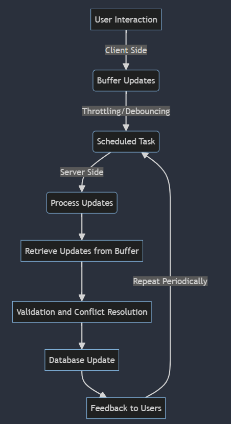

# Checkout process of an ecommerce app

> Basic flow is
> 
> **[ User updates cart -> User lands on orders page -> Proceeds to add address -> Make payment -> Receives ack -> Track the order]**

### Cart updation

When user logins a cart session is created on that user_session also created at login.

As the cart is updated the cart session is stored on redis for fast retrieval of cart updates based on the cart session.

>_[Note] - To handle cases in which user spams the cart update button we can implement debouncing or throttling to limit the
requests made to the server or we can rate limit the cart update route to avoid spam._

And as the details of cart are updated based on requirements the cart details with user id and cart session is updated
realtime or delayed. In realtime the updates are much faster but db load is increased and might result in delay and in case
of delayed update db load is decreased and can make bulk updates with more efficient queries.

> Q. Now how the cart update is synced across devices ? 

To sync across the logged in devices as the cart updates these updates are stored in cart db for persistency and a web socket
connection is made between server and all user session created for all the device user is logged in and preferably updates 
are done on the pull basis which is when user updates the screen or refresh the cart then the updates are fetched and displayed 
on that device.

> Also when user is at the cart page based on what user has added a particular recommendation is generated and shown to the
> user at that page like people also buy etc which is fetched from the recommendation service.

>Before updating the cart db the buffer updated from client is fetched and then it is firstly validated that is it a valid request
> and then it is compared with current state of data in db and based on certain rules such as last writer wins(latest update time) 
> the data is updated to the db 

## Payment Module

